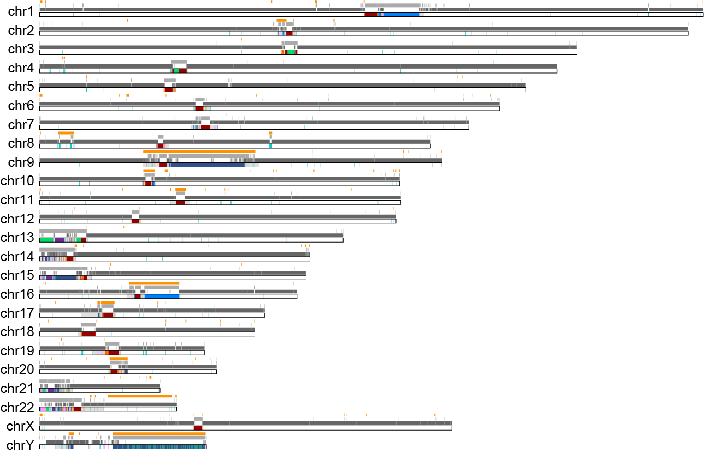

# T2T-Ref Figures

## Original tracks

```shell
# Size
scp helix.nih.gov:/data/Phillippy2/projects/T2T-Browser/T2Tgenomes/T2T-CHM13v2.0/chm13v2.0.sizes .
awk '{print $1"\t0\t"$2}' chm13v2.0.sizes > chm13v2.0.sizes.bed

# Cytoband: $projects2/T2T-Browser/incoming/GRCh
curl -l https://s3-us-west-2.amazonaws.com/human-pangenomics/T2T/CHM13/assemblies/annotation/chm13v2.0_cytobands_allchrs.bed > chm13v2.0_cytobands_allchrs.bed
mv chm13v2.0_cytobands_allchrs.bed chm13v2.0_cytobands_allchrs.txt

# GRCh38 Issues and Non-syntenic region: $projects2/T2T-Browser/incoming/GRCh/
curl -L https://s3-us-west-2.amazonaws.com/human-pangenomics/T2T/CHM13/publications/Nurk_2021/fig1/chm13v2.0_GRCh38issues_lifted.20230315.bed > chm13v2.0_GRCh38issues_lifted.20230315.bed
curl -l https://s3-us-west-2.amazonaws.com/human-pangenomics/T2T/CHM13/assemblies/chain/v1_nflo/chm13v2-unique_to_hg38.bed > chm13v2-unique_to_hg38.bed
curl -l https://s3-us-west-2.amazonaws.com/human-pangenomics/T2T/CHM13/assemblies/chain/v1_nflo/chm13v2-unique_to_hg19.bed > chm13v2-unique_to_hg19.bed

cat chm13v2.0_GRCh38issues_lifted.20230315.bed | awk '{print $1"\t"$2"\t"$3}' | bedtools merge -i - > chm13v2.0_GRCh38issues_lifted.20230315.fmt.bed
scp helix.nih.gov:/data/Phillippy2/projects/T2T-Browser/incoming/GRCh/*.fmt.bed .

# Accessibility mask: $projects2/T2T-Browser/incoming/accessability/
module load ucsc
bigBedToBed hs1.combined_mask.bb hs1.combined_mask.bed
bedtools merge -i hs1.combined_mask.bed -d 200 > hs1.combined_mask.mrg_200bp.bed
bedtools merge -i hs1.combined_mask.bed -d 1000 > hs1.combined_mask.mrg_1kb.bed
bedtools merge -i hs1.combined_mask.bed -d 10000 > hs1.combined_mask.mrg_10kb.bed
scp helix.nih.gov:/data/Phillippy2/projects/T2T-Browser/incoming/accessability/*.mrg_10kb.bed .
```

## CHM13v2 GRCh38 Issues Ideogram

* Plot with `plot_karyo.R`
* Output: `output/chm13v2.0_accessibility_legend.png` and `output/chm13v2.0_accessibility.png`



## DJ and PHR diagram

```shell
# Get everything on chr13 coordinates
bedtools intersect -a chm13v2.0.cenSatv2.1.bed -b acro.bed -wa | awk '$4!="ct" && $1=="chr13"' > acro.censat.chr13.bed
bedtools intersect -a chm13v2.0.cenSatv2.1.bed -b acro.bed -wa | awk '$4!="ct" && $1=="chr14" {print "chr13\t"$2"\t"$3"\t"$4"\t"$5"\t"$6"\t"$7"\t"$8"\t"$9 }' > acro.censat.chr14.bed
```