# DJ sequences and kmers

## Collect DJ k-mers per chromosome
```sh
module load R/4.4.3

# First attempt
samtools faidx -r DJ.list chm13v2.0.fa > dj.fa
meryl k=31 dj.fa output dj.meryl

# Second attempt: make sure the kmers are also present on per-chromosome DJs
for region in $(cat DJ.list)
do
  chr=`echo $region | awk -F ":" '{print $1}'`
  echo $region $chr
  samtools faidx chm13v2.0.fa $region > dj.$chr.fa
  meryl count k=31 dj.$chr.fa output dj.$chr.meryl
done

$MERQURY/plot/to_hist_for_plotting.sh dj.chr13.meryl DJ_chr13 dj.chr14.meryl DJ_chr14 dj.chr15.meryl DJ_chr15 dj.chr21.meryl DJ_chr21 dj.chr22.meryl DJ_chr22 > DJ_per_chr.hist
Rscript $MERQURY/plot/plot_spectra_cn.R -f DJ_per_chr.hist -t line -o DJ_per_chr

awk '$2<3' DJ_per_chr.hist
DJ_chr13        1       311242
DJ_chr13        2       16709
DJ_chr14        1       306132
DJ_chr14        2       18064
DJ_chr15        1       306481
DJ_chr15        2       17098
DJ_chr21        1       311364
DJ_chr21        2       16711
DJ_chr22        1       308657
DJ_chr22        2       17923
```
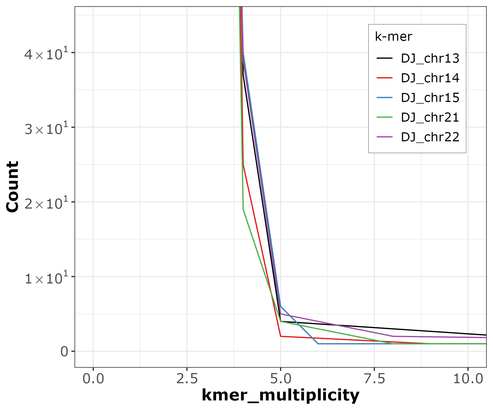

```sh
meryl intersect [ equal-to 1 dj.chr13.meryl ] [ equal-to 1 dj.chr14.meryl ] output dj.chr13_chr14.1.meryl
meryl intersect [ equal-to 1 dj.chr15.meryl ] [ equal-to 1 dj.chr21.meryl ] output dj.chr15_chr21.1.meryl
meryl intersect [ intersect dj.chr13_chr14.1.meryl dj.chr15_chr21.1.meryl ] [ equal-to 1 dj.chr22.meryl ] output dj.meryl
rm -r dj.chr13_chr14.1.meryl dj.chr15_chr21.1.meryl
```

```sh
meryl statistics dj.meryl | head

Found 1 command tree.
Number of 31-mers that are:
  unique                 178731  (exactly one instance of the kmer is in the input)
  distinct               178731  (non-redundant kmer sequences in the input)
  present                178731  (...)
```
* `178731` potential 'markers'
* Refine one more time based on frequency, we are expecting 10 copies in the genome

```sh
meryl intersect chm13.k31.meryl dj.meryl output dj.chm13_count.meryl
$MERQURY/plot/to_hist_for_plotting.sh chm13.k31.meryl CHM13 dj.chm13_count.meryl CHM13_DJ > dj.chm13_count.hist
Rscript $MERQURY/plot/plot_spectra_cn.R -f dj.chm13_count.hist -o dj.chm13_count -t line -m 1000 -n 1500
Rscript $MERQURY/plot/plot_spectra_cn.R -f dj.chm13_count.hist -o dj.chm13_count.all -t line -m 250
```
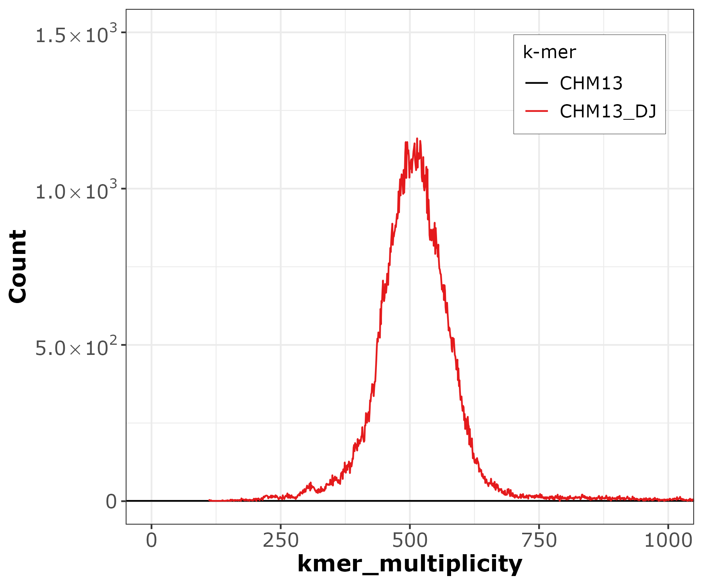
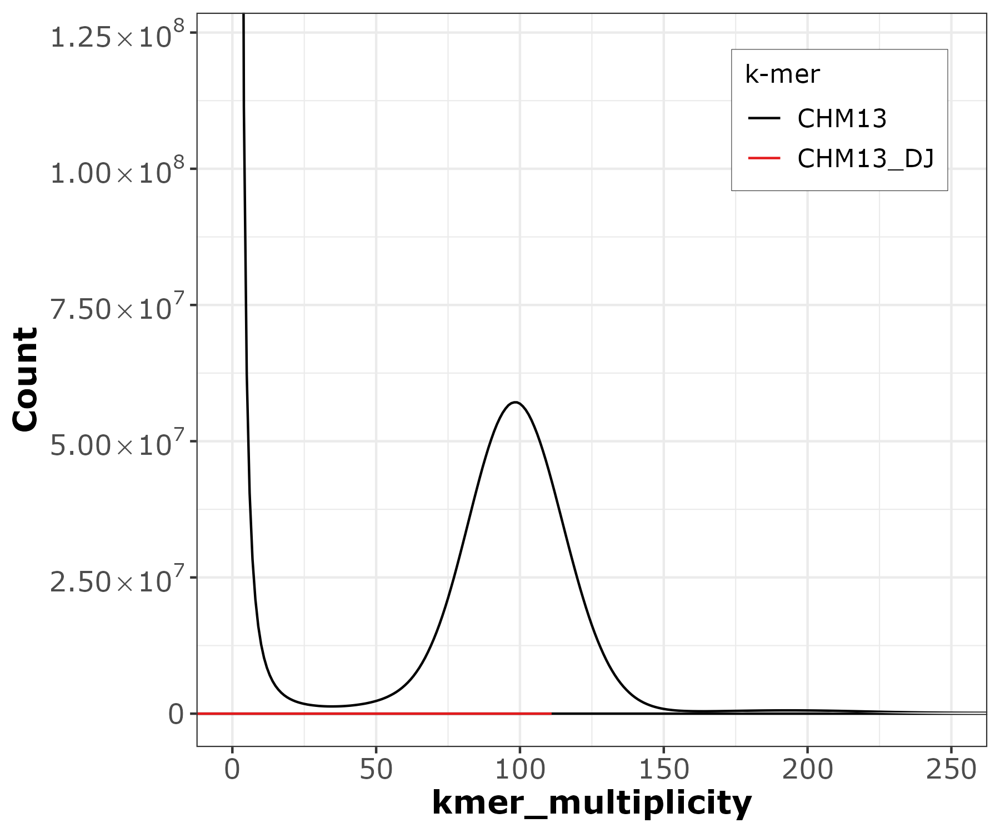

2x peak is at 98x;
49 x 10 = 490x is the approximate 10copy range.

What does GenomeScope2 predicts?
```sh
Rscript $tools/genomescope2.0/genomescope.R -i chm13.k31.hist -o chm13.k31.genomescope2 --fitted_hist -k 31
Model converged het:0.000672 kcov:49.9 err:0.00428 model fit:1.71 len:3163188740
```
GenomeScope2 predicts 1x at 49.9x; which is ~50x - using this, it matches the 500x peak.

Let's cut off kmers less informative for the DJ count prediction; with +- the 50x (25x)
```
50 x 9 = 450
50 x 10 = 500
50 x 11 = 550

(500-25) to (500 + 25) = 475-525
```

```sh
meryl greater-than 475 [ less-than 525 dj.chm13_count.meryl ] output dj.chm13_count.target.meryl
meryl statistics dj.chm13_count.target.meryl | head

Found 1 command tree.
Number of 31-mers that are:
  unique                      0  (exactly one instance of the kmer is in the input)
  distinct                52227  (non-redundant kmer sequences in the input)
  present              26140589  (...)
  missing   4611686018427335677  (non-redundant kmer sequences not in the input)
```
Might be too small, perhaps we need to widen the window. Let's see where the kmers are present.

## Counting 31-mers in known ROBs
`/data/Phillippy/seq/robertsonian/*/Illumina`

`/data/RPC_CHM13/rob_*/fastq/`

```
$MERQURY/_submit_build.sh 31 input.fofn $sample
```

## Control
* CHM13: `/data/Phillippy/seq/chm13/PCRfree/chm13.k31.meryl`
* HG002: `/data/Phillippy/seq/hpgp/HG002/illumina/HG002_2x250.k31.meryl`

## Where are the target kmers?

```shell
module load R
module load ucsc

for sample in chm13 HG002
do
  # Collect kmers from DJ
  meryl intersect threads=24 $sample.k31.meryl dj.chm13_count.target.meryl output $sample.k31.DJ.meryl
  $MERQURY/plot/to_hist_for_plotting.sh $sample.k31.DJ.meryl ${sample}_DJ  > ${sample}_DJ.hist
  Rscript $MERQURY/plot/plot_spectra_cn.R -f ${sample}_DJ.hist -t line -o ${sample}_DJ

  # Compare to ploidy=2
  java -jar -Xmx256m $MERQURY/eval/kmerHistToPloidyDepth.jar $sample.k31.hist > $sample.k31.ploidy
  
  # Make IGV tracks
  meryl-lookup -wig-count -sequence chr13.fa -output ${sample}_DJ.wig -mers ${sample}.k31.DJ.meryl
  wigToBigWig ${sample}_DJ.wig chr13.fa.fai ${sample}_DJ.bw
done
```
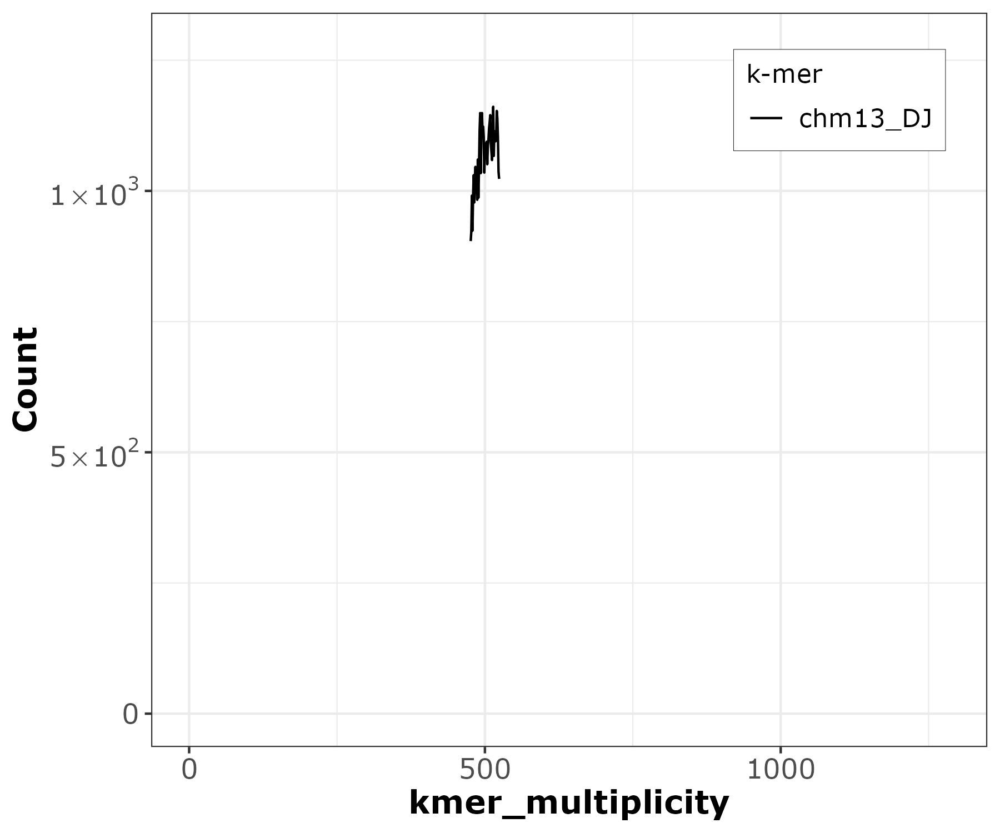
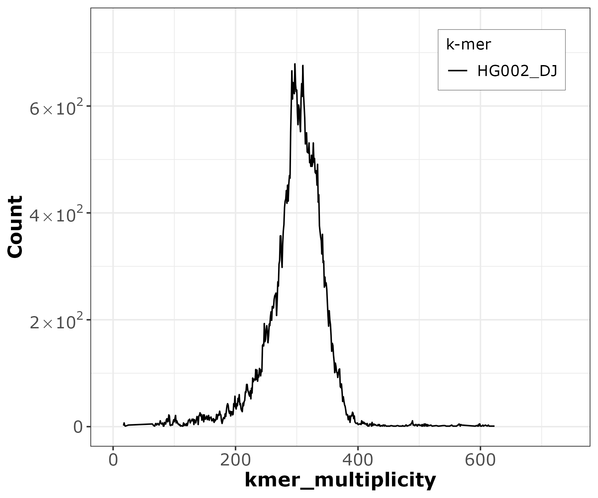

## Ploidy

```sh
for sample in chm13 HG002
do
  echo $sample
  cat  $sample.k31.ploidy
  echo
done
```

```
chm13
ploidy  depth   boundary
0       0       35
1       84      91
2       98      147

HG002
ploidy  depth   boundary
0       0       12
1       32      34
2       60      91
```

## DJ copy count estimates

kmer_multiplicity(Max DJ count) * 2 / 2x ploidy depth

```shell
for sample in chm13 HG002 # $(cat rob.list)
do
  
  DJ_Mult=`cat ${sample}_DJ.hist | awk 'BEGIN {MAX=0; mult=0} {if (NR>1 && $3>MAX) { MAX=$3; mult=$2; } } END {print mult}'`
  ploidy=`tail -n1 $sample.k31.ploidy | awk '{print $2}'`
  # echo "$DJ_Mult ${ploidy}"
  echo "$DJ_Mult ${ploidy}" | awk -v sample=$sample '{print sample"\t"((2*$1) / $2)}'
done
```
Output:
```
chm13   10.4898
HG002   9.9
```

## ROB sample kmer histogram
```shell
for sample in $(cat rob.list)
do
  samples_hist="${samples_hist} $sample.k31.meryl $sample"
done
$MERQURY/plot/to_hist_for_plotting.sh $samples_hist > rob_wgs.hist
Rscript $MERQURY/plot/plot_spectra_cn.R -f rob_wgs.hist -t line -o rob_wgs -m 100 -n 190000000
```
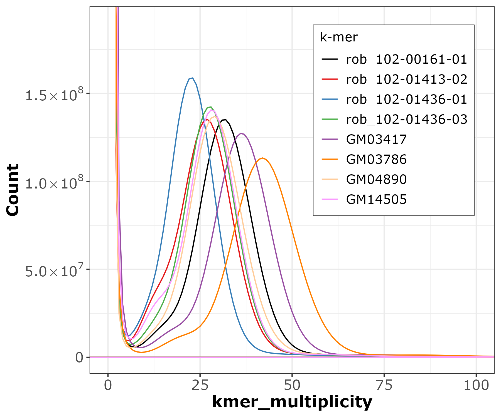

## Apply on ROB samples
```shell
module load R
module load ucsc

for sample in $(cat rob.list)
do
  # Collect kmers from DJ
  meryl intersect threads=24 $sample.k31.meryl dj.chm13_count.target.meryl output ${sample}.k31.DJ.meryl
  $MERQURY/plot/to_hist_for_plotting.sh ${sample}.k31.DJ.meryl ${sample}_DJ  > ${sample}_DJ.hist
  Rscript $MERQURY/plot/plot_spectra_cn.R -f ${sample}_DJ.hist -t line -o ${sample}_DJ
  
  # Make IGV tracks
  meryl-lookup -wig-count -sequence chr13.fa -output ${sample}_DJ.wig -mers ${sample}.k31.DJ.meryl
  wigToBigWig ${sample}_DJ.wig chr13.fa.fai ${sample}_DJ.bw
done
```

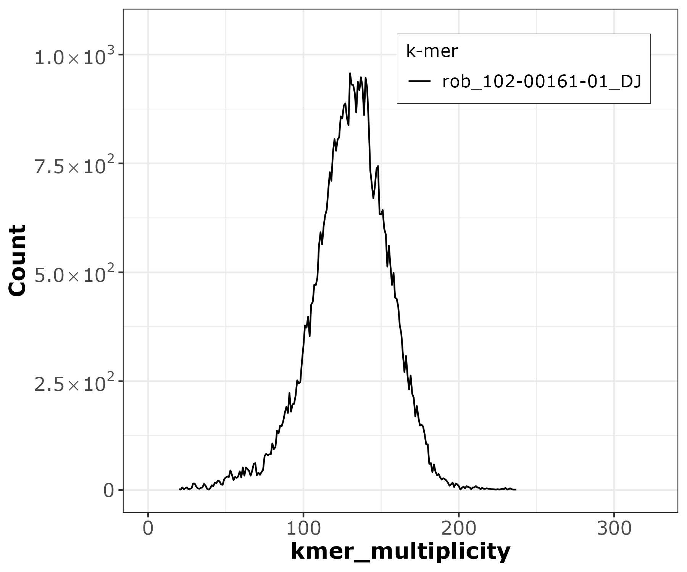
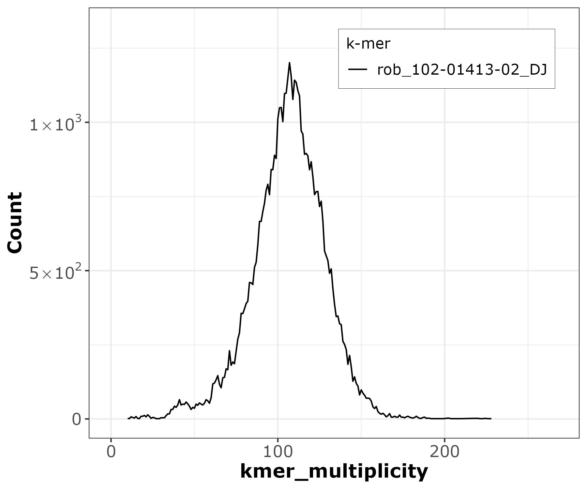
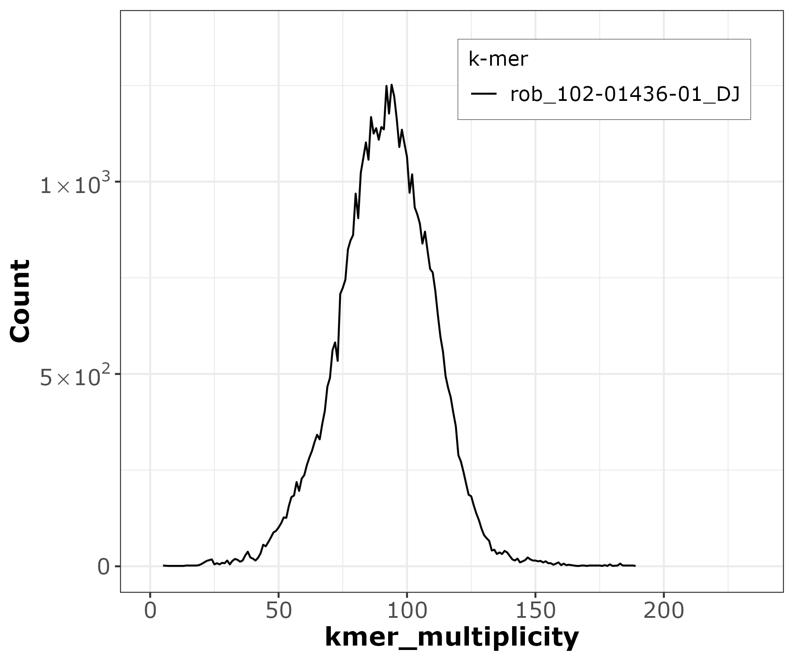
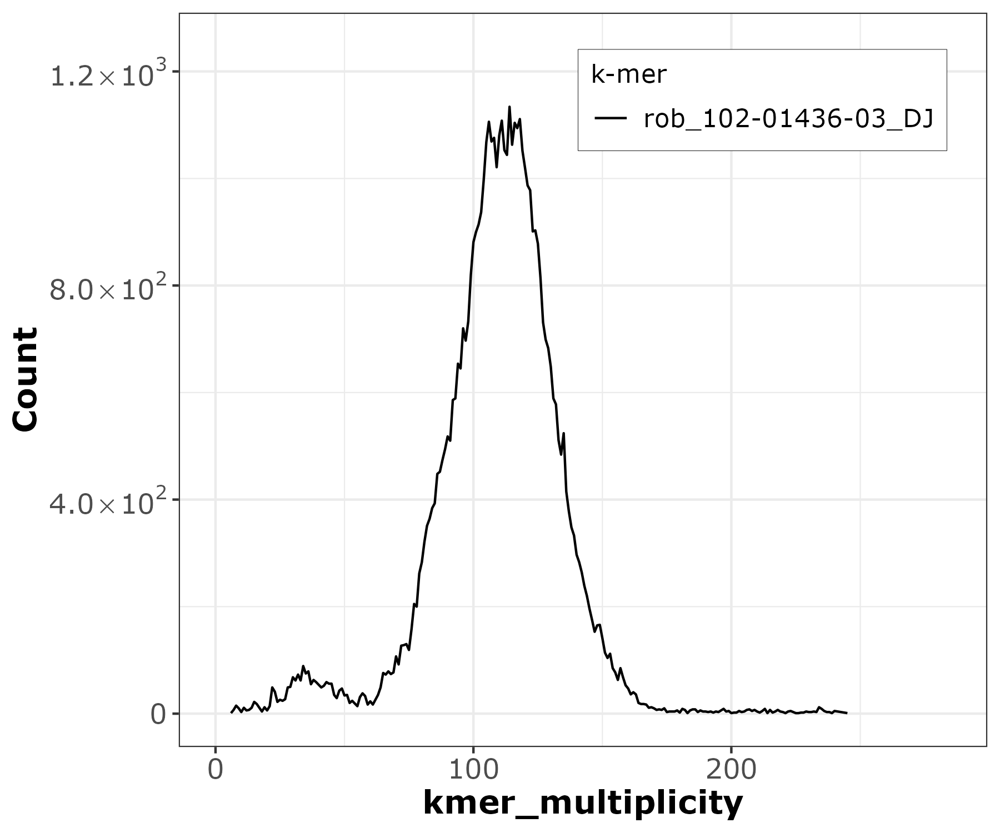
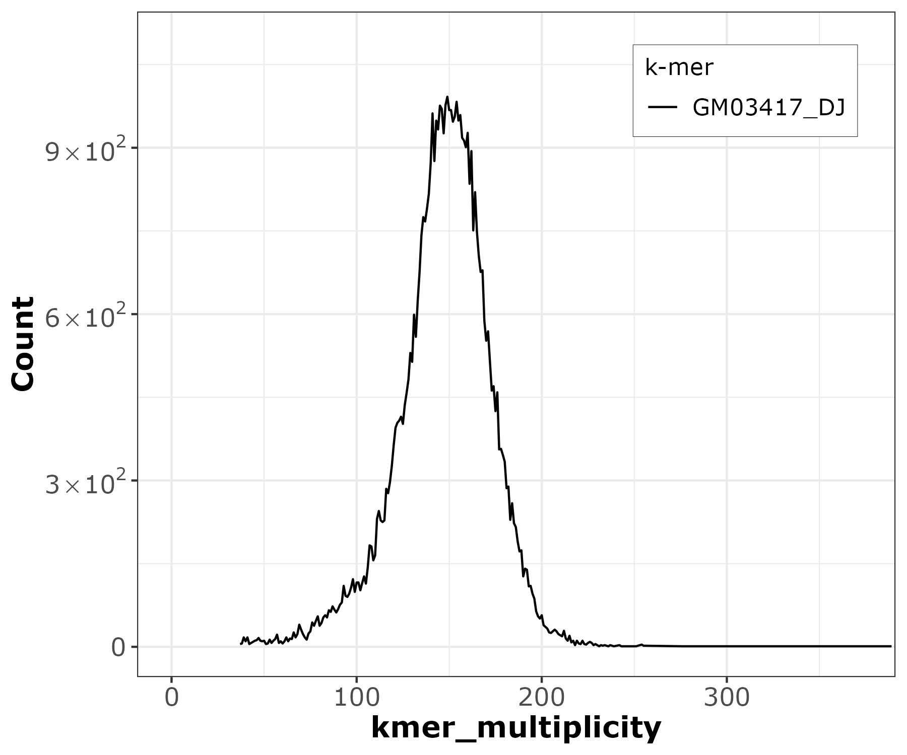
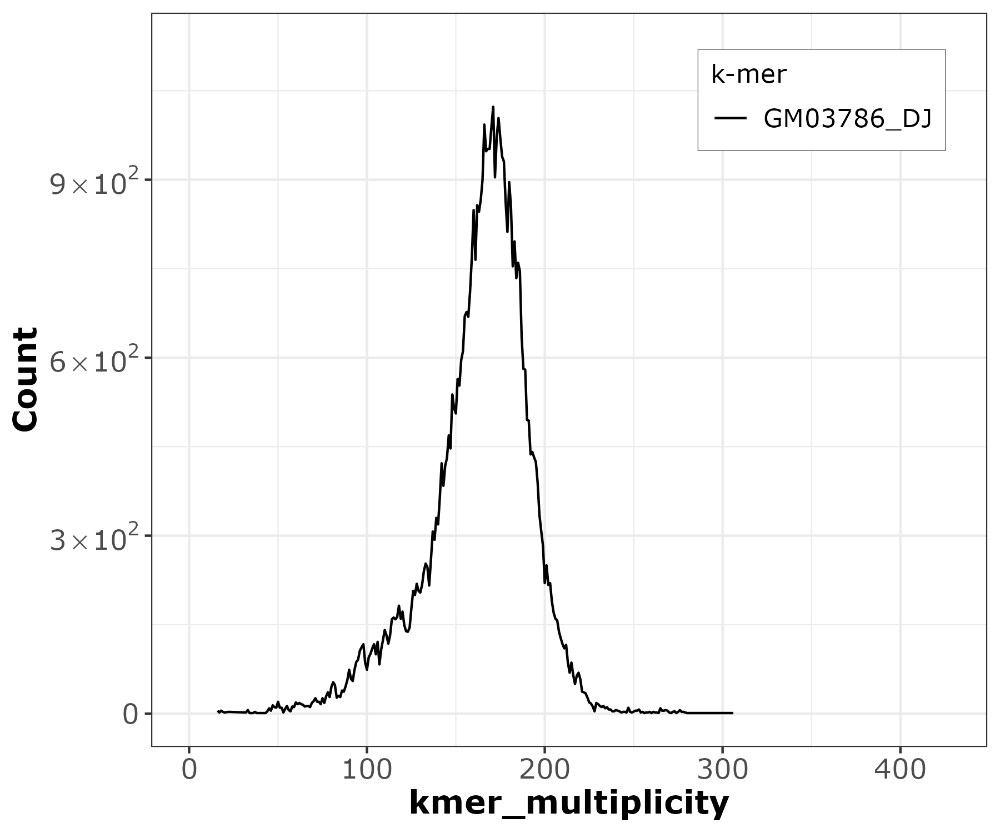
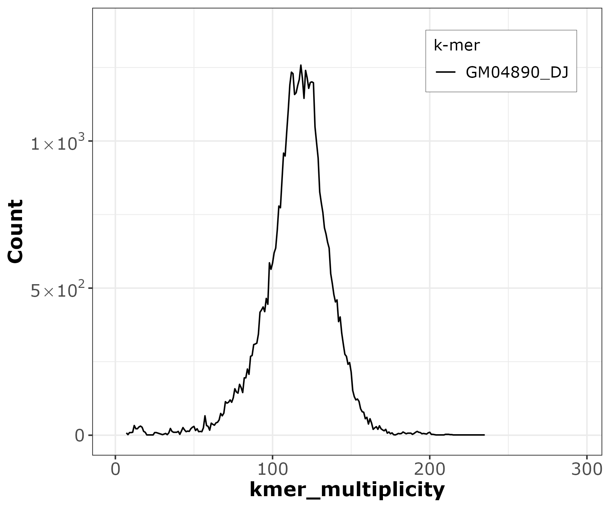
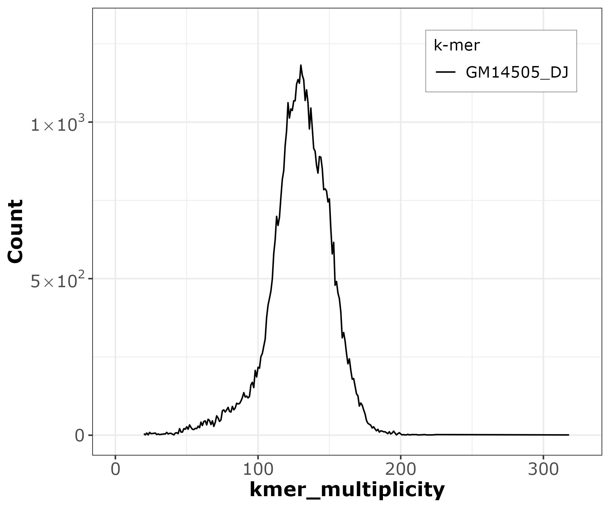

```shell
for sample in $(cat rob.list)
do
  echo $sample
  java -jar -Xmx256m $MERQURY/eval/kmerHistToPloidyDepth.jar $sample.k31.hist > $sample.k31.ploidy
done
```

## ROB samples' DJ Counting

```shell
for sample in $(cat rob.list)
do
  
  DJ_Mult=`cat ${sample}_DJ.hist | awk 'BEGIN {MAX=0; mult=0} {if (NR>1 && $3>MAX) { MAX=$3; mult=$2; } } END {print mult}'`
  ploidy=`tail -n1 $sample.k31.ploidy | awk '{print $2}'`
  # echo "$sample $DJ_Mult ${ploidy}"
  echo "$DJ_Mult ${ploidy}" | awk -v sample=$sample '{print sample"\t"((2*$1) / $2)}'
done
```

Output:
```
rob_102-00161-01        8.125
rob_102-01413-02        7.92593
rob_102-01436-01        8.17391
rob_102-01436-03        8.14286
GM03417 8.27778
GM03786 8.14286
GM04890 8.13793
GM14505 9.28571
```

## Using median instead of max

```shell
for sample in chm13 HG002 $(cat rob.list) 
do
  
  count=`cat ${sample}_DJ.hist | awk '{if (NR>1) { count+=$NF;} } END {print count/2}'`
  med=`cat ${sample}_DJ.hist | \
         awk -v cnt=$count '{cnt_sum+=$NF; if (NR>1 && cnt_sum > cnt) {print $(NF-1); exit;} }'`
  ploidy=`tail -n1 $sample.k31.ploidy | awk '{print $2}'`
  echo "$med ${ploidy}" | awk -v sample=$sample '{print sample"\t"((2*$1) / $2)}'
done
```
Output
```
chm13 10.2245
HG002 10.1
rob_102-00161-01  8.1875
rob_102-01413-02  7.92593
rob_102-01436-01  8
rob_102-01436-03  7.92857
GM03417 8.27778
GM03786 7.95238
GM04890 8.06897
GM14505 9.35714
```
Seems more reliable!

## Visualizing the kmer frequency on the CHM13 Chr13 DJ

Collect the data range and 10 copy threshold
```sh
echo "Sample 2x 10x 18x"
for sample in chm13 HG002 $(cat rob.list)
do
  ploidy=`tail -n1 $sample.k31.ploidy | awk '{print $2}'`
  echo "$sample ${ploidy}" $((ploidy*5)) $((ploidy*9))
done
```
```
chm13 98 490 882
HG002 60 300 540
GM03417 36 180 324
GM03786 42 210 378
GM04890 29 145 261
GM14505 28 140 252
rob_102-00161-01 32 160 288
rob_102-01413-02 27 135 243
rob_102-01436-01 23 115 207
rob_102-01436-03 28 140 252
```
```sh
echo "Sample 2x 8x 18x"
for sample in $(cat rob.list)
do
  ploidy=`tail -n1 $sample.k31.ploidy | awk '{print $2}'`
  echo "$sample ${ploidy}" $((ploidy*4)) $((ploidy*9))
done
```
```
GM03417 36 144 324
GM03786 42 168 378
GM04890 29 116 261
GM14505 28 112 252
rob_102-00161-01 32 128 288
rob_102-01413-02 27 108 243
rob_102-01436-01 23 92 207
rob_102-01436-03 28 112 252
```

## Plot frequency of DJ kmers in 8x and 10x
Trying poisson distribution with lambda=8 or 10 under `/home/rhiea/Scratch/T2T-Ref/src`


## CHM13 kmer frequency on Chr. 13

```shell
module load ucsc

# dj.meryl: DJ kmers found once in each chromosomal DJ region
meryl intersect chm13.k31.meryl dj.meryl output dj.chr13.all.meryl
samtools faidx -@12 chm13v2.0.fa chr13 > chr13_all.fa
samtools faidx chr13_all.fa
meryl-lookup -wig-count -sequence chr13_all.fa -mers dj.chr13.all.meryl > dj.chr13.all.wig
wigToBigWig dj.chr13.all.wig chr13_all.fa.fai dj.chr13.all.bw

# This is the same as above
meryl-lookup -wig-count -sequence chr13_all.fa -mers dj.chm13_count.meryl > chr13.all.wig
wigToBigWig chr13.all.wig chr13_all.fa.fai chr13.all.bw
```

Draw dj.chm13_count.meryl and the final target.meryl
```sh
module load R
$MERQURY/plot/to_hist_for_plotting.sh dj.chm13_count.meryl DJ chm13.k31.DJ.meryl DJ_Target > CHM13_DJ_target.hist
Rscript $MERQURY/plot/plot_spectra_cn.R -f CHM13_DJ_target.hist -o CHM13_DJ_target -t line -m 1000 -n 1500
Rscript $MERQURY/plot/plot_spectra_cn.R -f CHM13_DJ_target.hist -o CHM13_DJ_target -t line -m 1000 -n 1500 -p
```
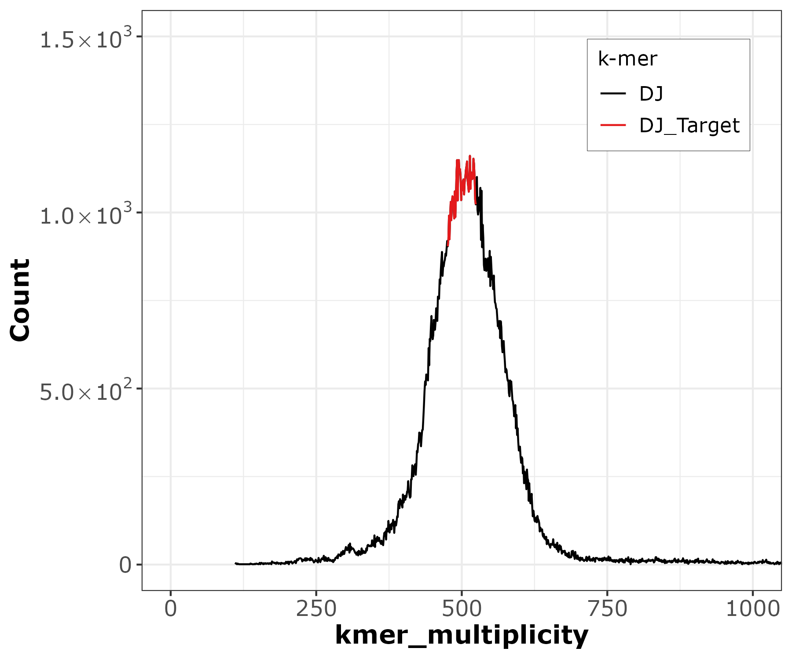
